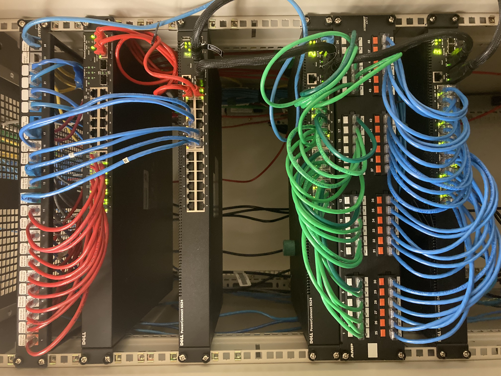

  

The network structure present in the computer labs used to be flat, with no distinct layers between each switch causing congestion on the network. The lab computers had network speeds at times due to this issue. A three-tier network structure was implemented to increase bandwidth and remove bottlenecks that were previously present.

My coworkers and I first had to plan out how we were going to deploy the new structure to decrease the downtime of the room. Then we set up wall plates, ran ethernet cables, patched keystones, and configured switches to finish the project. It took us a little over a month to complete all the necessary steps including removing the old network and setting up our network.

This project gave me experience breaking down a big project into smaller components that build upon each other. I also got some experience on how to effectively communicate instructions with my other coworkers. Implementing the new hierarchy also improved my understanding of network hierarchy and the physical component of a computer network.

Cover Photo by <a href="https://unsplash.com/@thomasjsn?utm_source=unsplash&utm_medium=referral&utm_content=creditCopyText">Thomas Jensen</a> on <a href="https://unsplash.com/s/photos/network-rack?utm_source=unsplash&utm_medium=referral&utm_content=creditCopyText">Unsplash</a>
  
