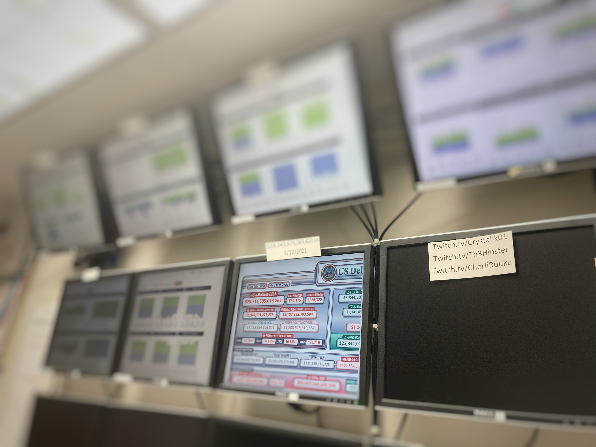

  

One of the projects that I undertook at work was displaying the network performance onto monitors. There was an unused monitor wall in the office and to make use of it we decided to display the network performance on those monitors. The machines used to display the performance were set to automatically login to a specified account using registry editor, and to open the website that had a specific widget displaying the performance. I learned a lot about the registry and its functions. It also taught me how to search the web efficiently.

Cover Photo by <a href="https://unsplash.com/@lukechesser?utm_source=unsplash&utm_medium=referral&utm_content=creditCopyText">Luke Chesser</a> on <a href="https://unsplash.com/s/photos/dashboard?utm_source=unsplash&utm_medium=referral&utm_content=creditCopyText">Unsplash</a>
  
