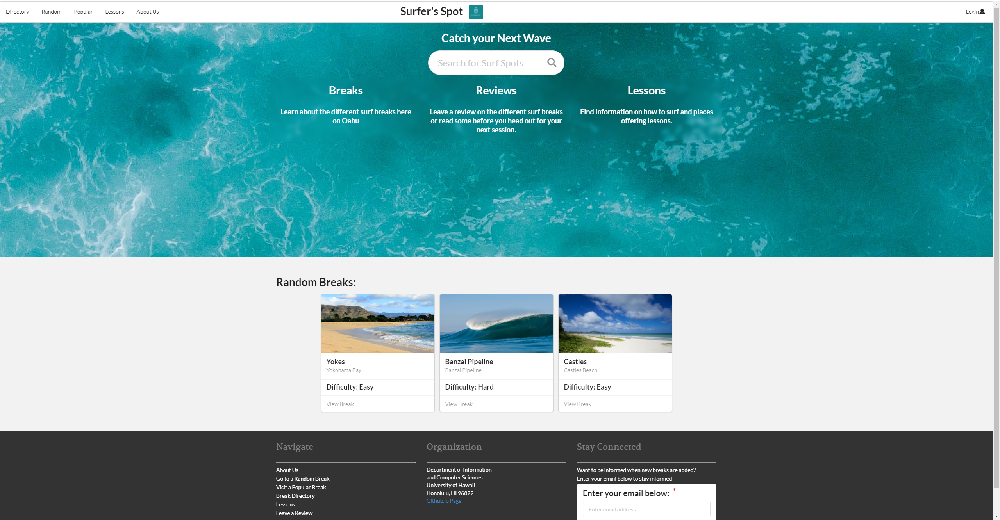
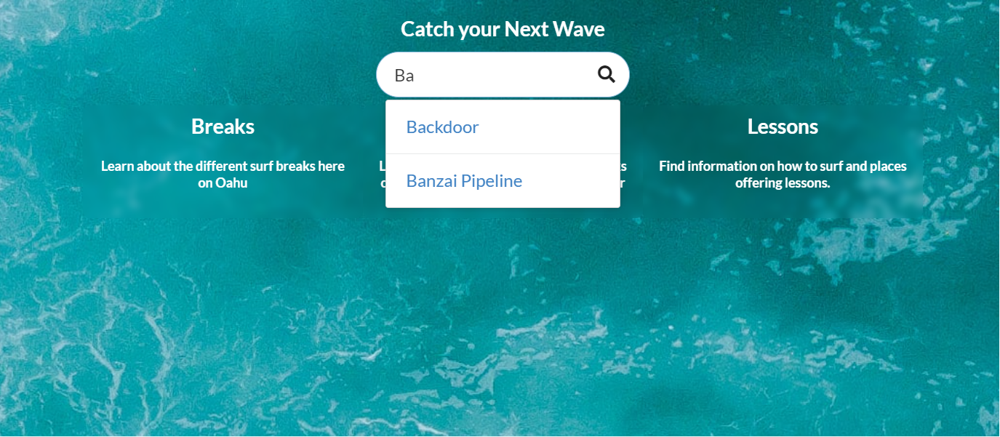

  

### Overview

For the final project for ICS 314, my group and I had to create a web application on finding information on surf breaks in Hawaii. It is similar to the site, <a href = "https://www.alltrails.com/"> All Trials</a>, which is an app for finding information on outdoor activities such as hiking, mountain biking, climbing, and snow sports. There is not a site like this for surfing, so we created one. The application was made with new and beginning surfers in mind to help them learn how and where to surf. The app contains a directory of surf breaks, information about surf lessons, and reviews that can be helpful for each surf break. We provided the name, difficulty, type, location, and a brief description of each surf break. There were random and popular buttons on the navigation bar which took a user to the corresponding page if they couldn’t decide where to go. This project was done using Meteor, React, Semantic UI, and MongoDB following Issue Driven Project Management. 

### Contribution

  

It feels like I did a lot of the work on this project. I mainly focused on the “aesthetics” of each page while my peers focused on the other part of the project. I came up with the landing page for the application as well as the custom card design for each surf break. The random breaks and the search bar shown on the landing page were also done by me. I also figured out how to create each surf break page automatically, pulling information from the database. Before I had figured the view page, my groupmates were creating pages for each surf break manually, increasing the number of files being stored. The reviews collection in the database was not done by me, however, I implemented the reviews section on the view break page. I figured out how to link the reviews collection and break collection so that only relevant data is being displayed on the page. I also thought of a way to add reviews to the collection so that it would correlate to each break.  I also added the background images to the landing page, lessons page, and directory page.  

### My new skills

I learned a lot about CSS through this project. The background blur effect that is seen in the landing page of the project took me a while to figure out, but once I did it was very rewarded. I also learned that attention to detail like the blurred background makes a project look a lot nicer. The addition of background images on the popular and directory pages made the cards stand out more. I also had an appreciation of the documentation present on the semantic UI react page. There were many components that I was using for the first time in this project and the documentations was really helpful in figuring how things worked. 

For more information:

<a href = "https://github.com/surfers-spot/surfers-spot">Source Code</a>

<a href = "https://surfers-spot.github.io/">Github.io Page</a>

<a href = "https://surfersspot.xyz/#/">Current Deployment</a>
