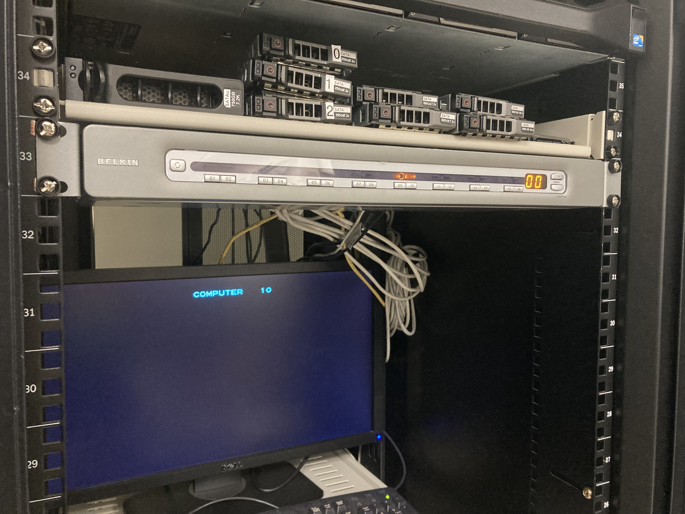

  

One of the jobs done at my workplace is the management of the workstations in the Information Computer Science department at the University of Hawaii at Manoa. Computers are rebuilt, added to the domain, and given to students, staff, and faculty present in the department. The computers are first stripped of their existing operating system and a new windows OS is pushed out. Many machines were rebuilt at the same time using a keyboard, video, and mouse (KVM) switch. Then, the machines are added to their specific domain, and applications are pushed to it using PDQ. Finally, after all the programs are pushed, the workstations are placed where they need to be. The machines are maintained by us and any issue that comes up is taking quickly. This project taught me a lot about port-based VLANs, Active directory, KVM switches, and PDQ.

Cover Photo by <a href="https://unsplash.com/@radowanrehan?utm_source=unsplash&utm_medium=referral&utm_content=creditCopyText">Radowan Nakif Rehan</a> on <a href="https://unsplash.com/s/photos/workstation?utm_source=unsplash&utm_medium=referral&utm_content=creditCopyText">Unsplash</a>
  
